# ACCELERATOR EDITION - Architecture & Process Diagrams

**Investment**: €15 Million | **Timeline**: 9-18 months to profitability | **Target**: Fastest Secure PaaS to Market

---

## 1. System Architecture Overview

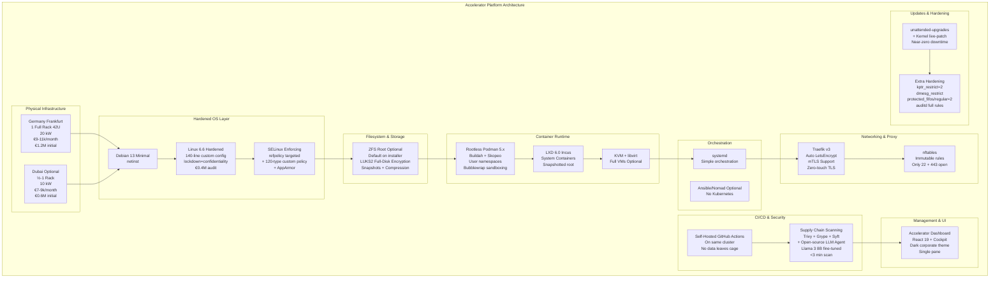

---

## 2. Deployment Process Flow

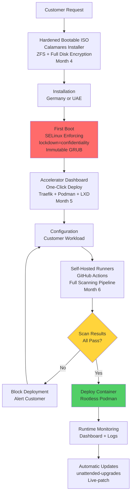

---

## 3. CI/CD Security Pipeline

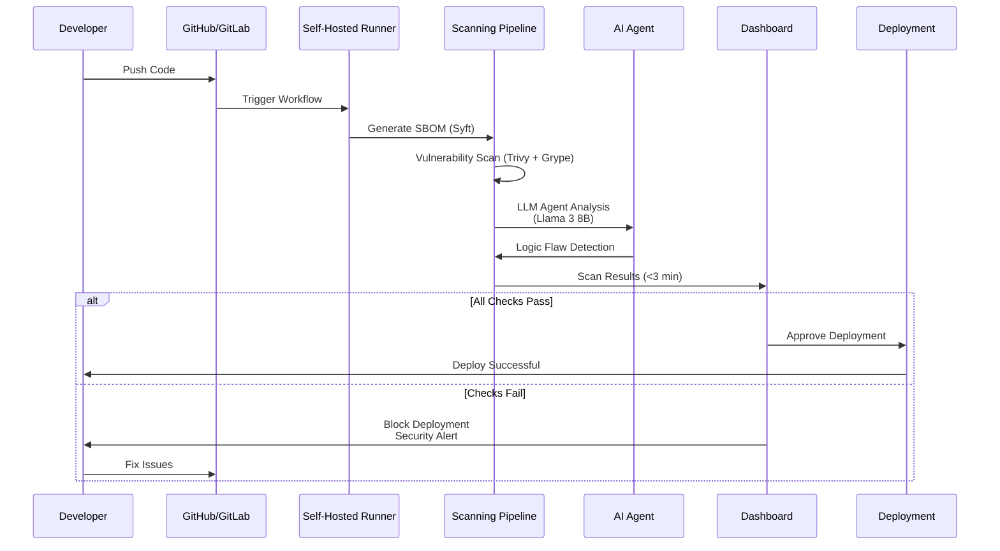

---

## 4. Cost Breakdown (18-Month CAPEX)

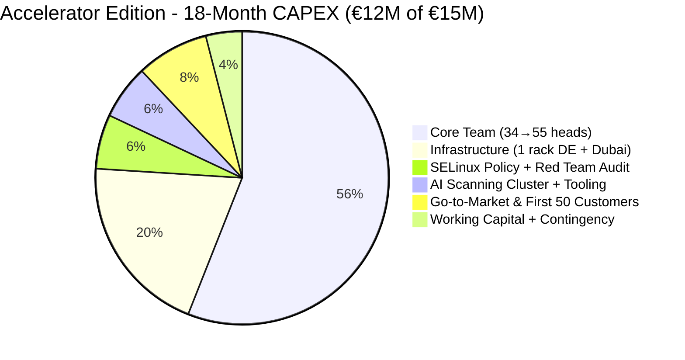

---

## 5. Detailed Cost Flow

```mermaid
graph TD
    TOTAL[Total Raise: €15M]
    
    subgraph "People (€8.4M over 18mo)"
        EXEC[Executive Team<br/>2 heads: CTO, CISO<br/>€0.9M/year]
        LEADS[Tech Leads<br/>4 heads<br/>€0.72M/year]
        CORE[Core Systems C/Python/DevOps<br/>7 heads<br/>€1.26M/year]
        AI_TEAM[AI/ML Specialists<br/>4 heads<br/>€0.72M/year]
        FRONTEND[Frontend/TypeScript/UI<br/>4 heads<br/>€0.64M/year]
        DEVOPS[DevOps/SRE<br/>6 heads<br/>€1.2M/year]
        QA[QA/Red Team<br/>3 heads<br/>€0.6M/year]
        LEGAL[Legal/Compliance/Sales<br/>2 heads<br/>€0.4M/year]
        SCRUM[Scrum Masters/PMs<br/>2 heads<br/>€0.3M/year]
    end
    
    subgraph "Infrastructure (€3.0M)"
        RACK_DE[1 Rack Germany<br/>Maincubes/Equinix FR8<br/>€1.2M]
        RACK_AE[Dubai Presence<br/>½-1 rack<br/>€0.6M]
        SERVERS[Basic Servers<br/>TPM 2.0<br/>€0.8M]
        NETWORK[Network Setup<br/>€0.4M]
    end
    
    subgraph "Security & Compliance (€0.9M)"
        SELINUX[SELinux Policy Finalization<br/>€0.4M]
        REDTEAM[Red Team Audit<br/>TÜViT light audit<br/>€0.4M]
        BUG[Bug Bounty Program<br/>€0.1M]
    end
    
    subgraph "AI & Tooling (€0.9M)"
        GPU[Small GPU Nodes<br/>On-prem<br/>€0.5M]
        TOOLS[Open Models + Tooling<br/>€0.4M]
    end
    
    subgraph "Go-to-Market (€1.2M)"
        CONF[Conferences<br/>€0.3M]
        CONTENT[Content Marketing<br/>€0.2M]
        SALES[Founder-Led Sales<br/>€0.4M]
        FIRST50[First 50 Customers<br/>€0.3M]
    end
    
    subgraph "Working Capital (€0.6M)"
        CONTINGENCY[20% Contingency<br/>€0.6M<br/>24+ month runway]
    end
    
    TOTAL --> EXEC
    TOTAL --> RACK_DE
    TOTAL --> SELINUX
    TOTAL --> GPU
    TOTAL --> CONF
    TOTAL --> CONTINGENCY
```

---

## 6. Timeline & Milestones (18 Months)

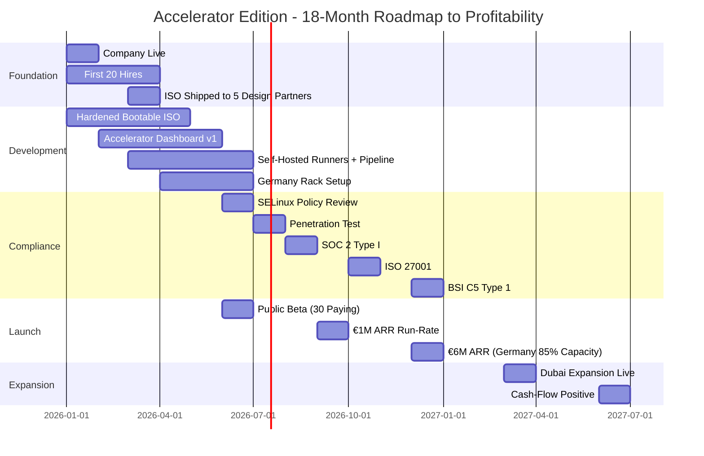

---

## 7. Customer Onboarding Flow

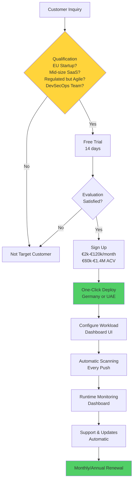

---

## 8. Security Guarantee Flow

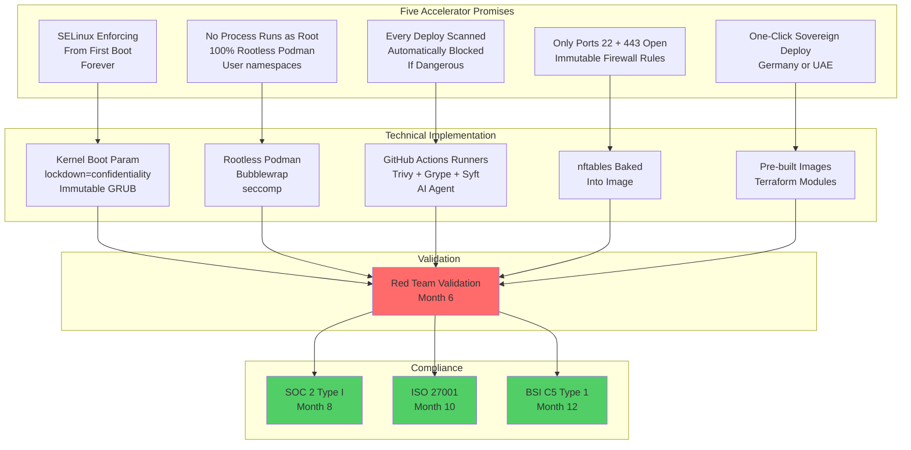

---

## 9. Revenue Projection Timeline

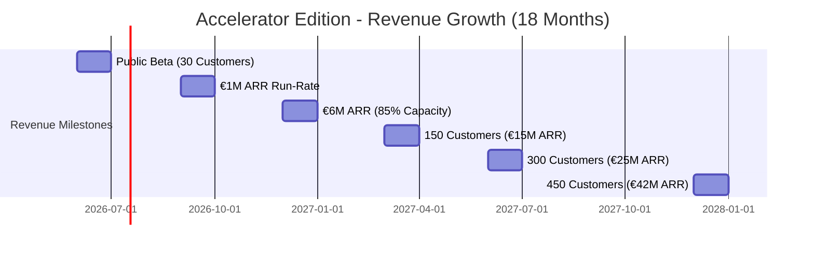

---

## 10. OPEX Breakdown (Year 3 Steady-State)

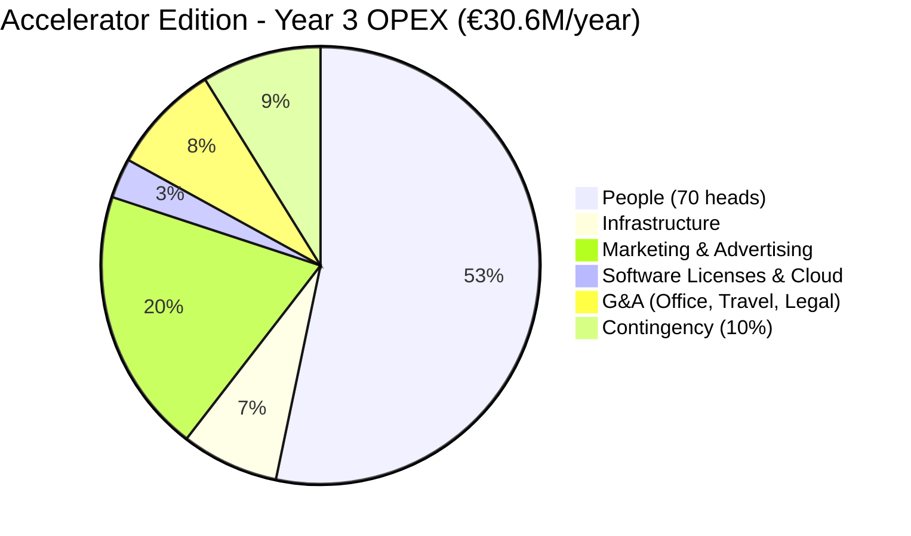

---

## 11. Team Structure & Headcount Growth

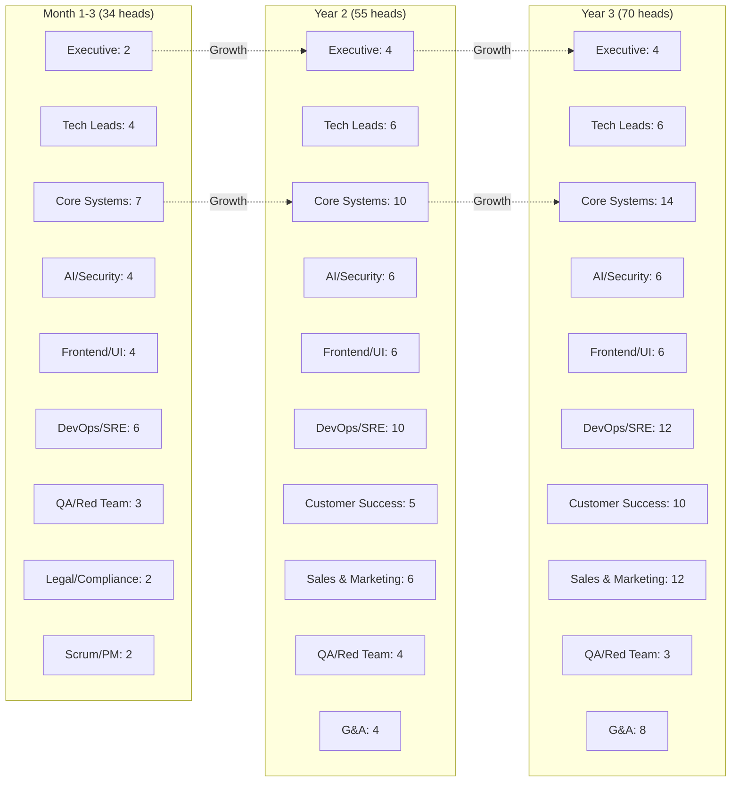

---

## 12. Infrastructure Setup

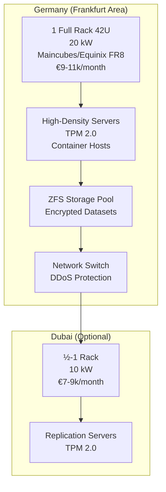

---

## 13. Compliance Roadmap

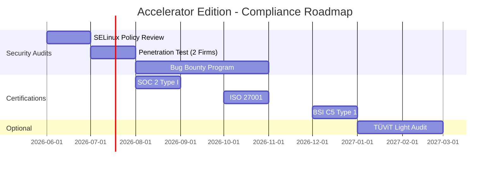

---

## 14. Customer Segmentation & Pricing

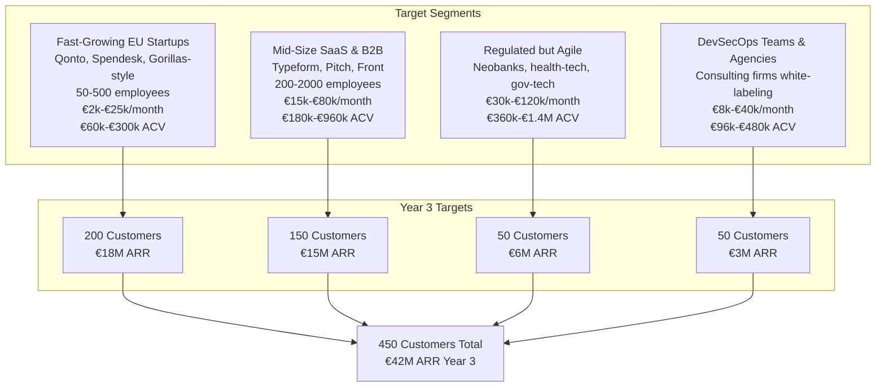

---

## 15. Performance Benchmarks

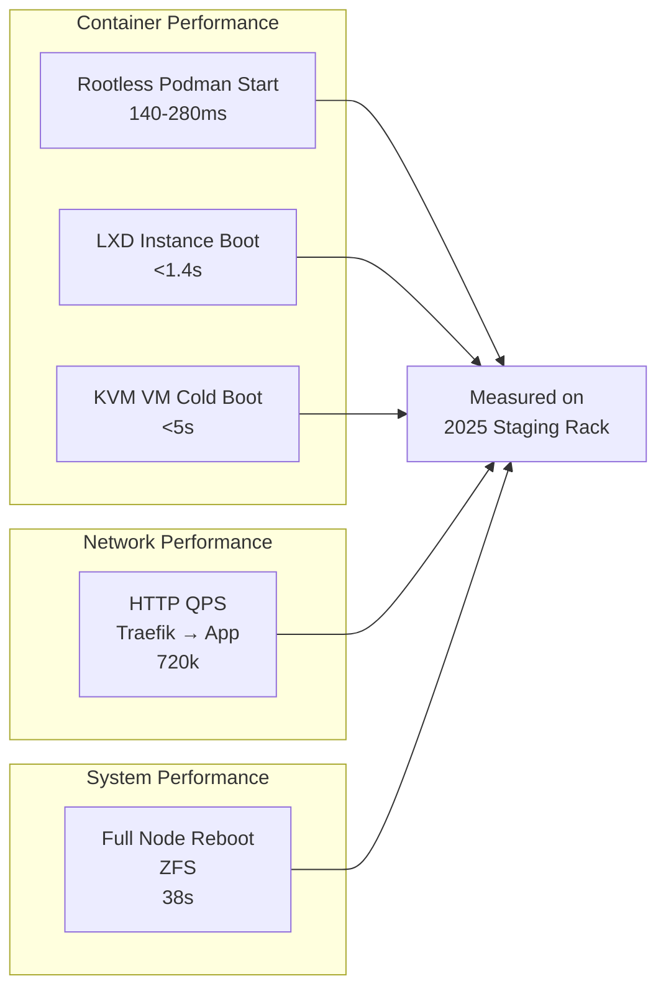

---

## 16. Risk & Mitigation Flow

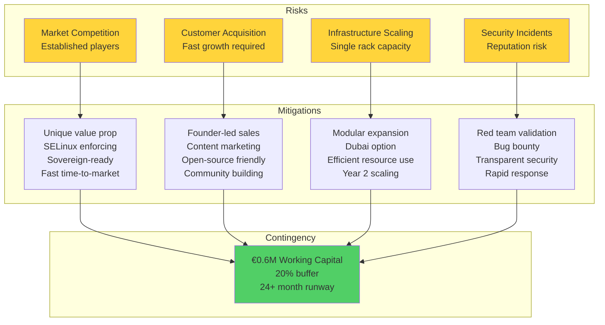

---

## 17. Competitive Comparison

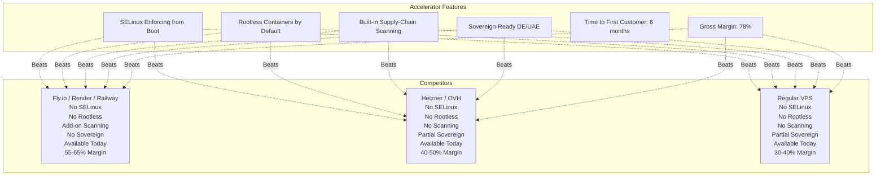

---

## 18. Success Metrics Dashboard

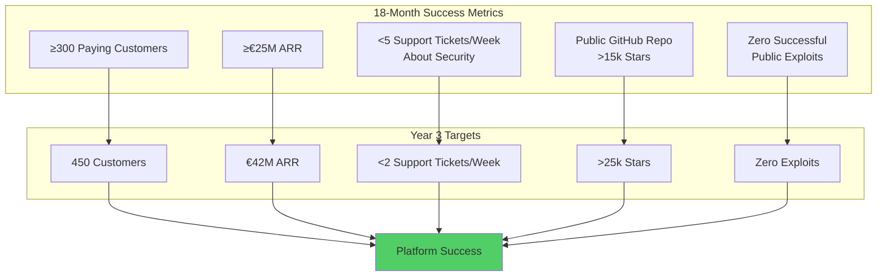

---

**Last Updated**: January 2026  
**Document Version**: 1.0

