# ENTERPRISE EDITION - Architecture & Process Diagrams

**Investment**: €50 Million | **Timeline**: 24 months to positive cash flow | **Target**: EAL4+/FIPS 140-3 Government-Grade PaaS

---

## 1. System Architecture Overview

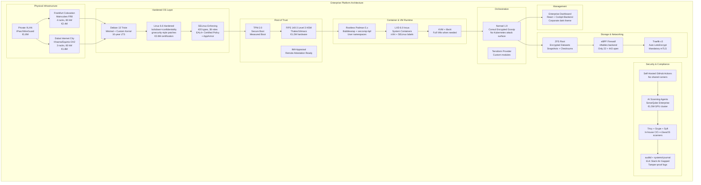

---

## 2. Certification & Compliance Process

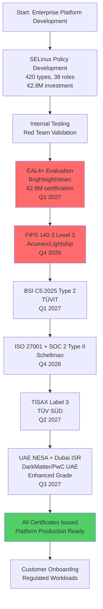

---

## 3. Deployment & Boot Process

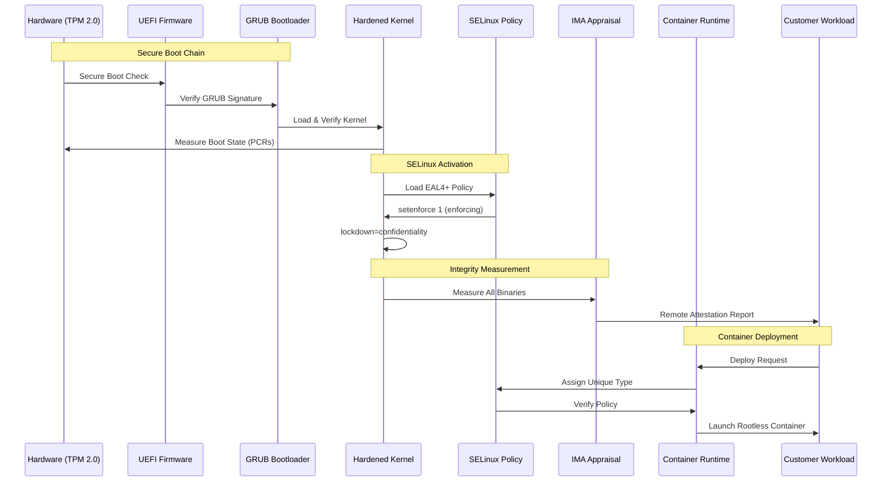

---

## 4. Supply Chain Security Flow

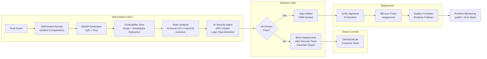

---

## 5. Cost Breakdown (18-Month CAPEX)

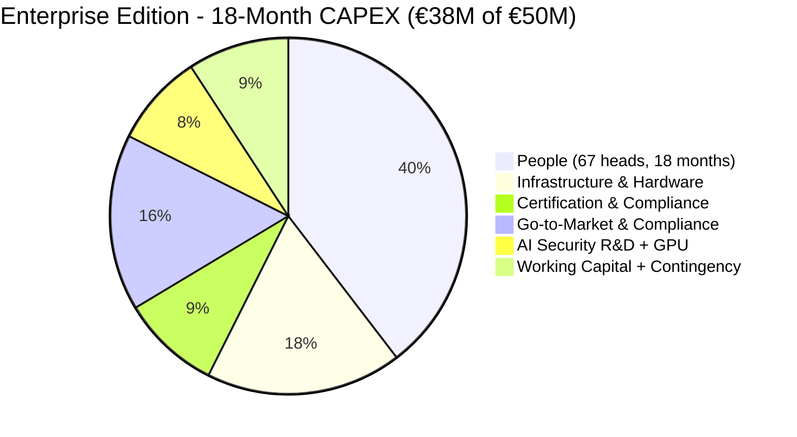

---

## 6. Detailed Cost Flow

```mermaid
graph TD
    TOTAL[Total Raise: €50M]
    
    subgraph "Certification & Compliance (€4.5M)"
        EAL4_CERT[EAL4+ Certification<br/>€2.8M<br/>Brightsight/atsec/TÜViT<br/>SELinux policy + kernel]
        FIPS_CERT[FIPS 140-3 Level 3<br/>€0.8M<br/>Acumen/Lightship]
        AUDIT[Basic CC EAL4+ Audit<br/>€0.4M<br/>Penetration testing lab]
        COMP[Compliance Audits<br/>€0.9M<br/>SOC 2, ISO 27001, TISAX, NESA<br/>Annual recurring]
    end
    
    subgraph "People (€19.8M over 18mo)"
        EXEC[Executive Team<br/>3 heads: CTO, CISO, VP Eng<br/>€1.5M/year]
        LEADS[Tech Leads<br/>8 heads<br/>€1.4M/year]
        KERNEL[Core Systems C/C++/Rust<br/>14 heads<br/>€2.52M/year]
        AI_TEAM[AI/ML Specialists<br/>9 heads<br/>€1.62M/year]
        FRONTEND[Frontend/TypeScript/UI-UX<br/>7 heads<br/>€1.12M/year]
        DEVOPS[DevOps/SRE/Security Ops<br/>12 heads<br/>€2.4M/year]
        QA[QA/Red Team<br/>6 heads<br/>€1.2M/year]
        LEGAL[Legal/Compliance/Sales<br/>4 heads<br/>€0.8M/year]
        SCRUM[Scrum Masters/PMs<br/>4 heads<br/>€0.6M/year]
    end
    
    subgraph "Infrastructure (€8.9M)"
        COLO[Tier-3 Colo Racks<br/>4 in DE + 3 in UAE<br/>€2.4M]
        SERVERS[High-Assurance Servers<br/>Dell with TPM 2.0 + HSM<br/>€3.5M]
        HSM_HW[HSMs, Secure Boot Keys<br/>€1.2M]
        NETWORK[Network Infrastructure<br/>100 Gbps DDoS-protected<br/>€1.8M]
    end
    
    subgraph "Go-to-Market (€8.0M)"
        LEGAL_GTM[Legal & Compliance Prep<br/>€2M]
        MARKETING[Marketing & Sales<br/>€3M]
        FIRST_CUST[First 10 Logos<br/>€3M]
    end
    
    subgraph "AI Security R&D (€4.2M)"
        GPU[GPU Cluster<br/>On-prem + cloud credits<br/>€1.5M]
        AI_DEV[AI Security Development<br/>€2.7M]
    end
    
    subgraph "Working Capital (€4.6M)"
        CONTINGENCY[20% Contingency<br/>€4.6M<br/>18-month runway post-MVP]
    end
    
    TOTAL --> EAL4_CERT
    TOTAL --> EXEC
    TOTAL --> COLO
    TOTAL --> LEGAL_GTM
    TOTAL --> GPU
    TOTAL --> CONTINGENCY
```

---

## 7. Timeline & Milestones (24 Months)

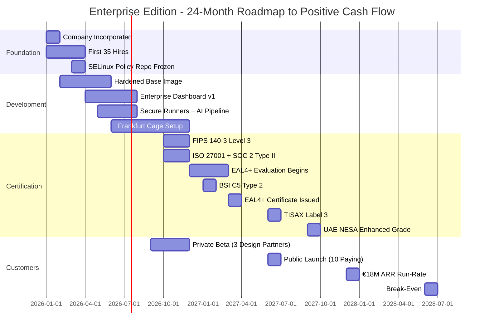

---

## 8. Customer Onboarding Flow

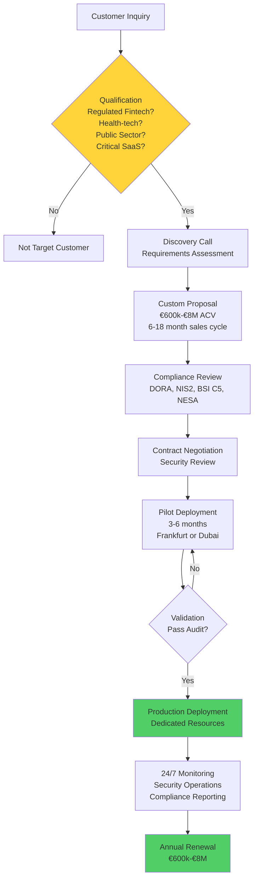

---

## 9. Security Guarantee Flow

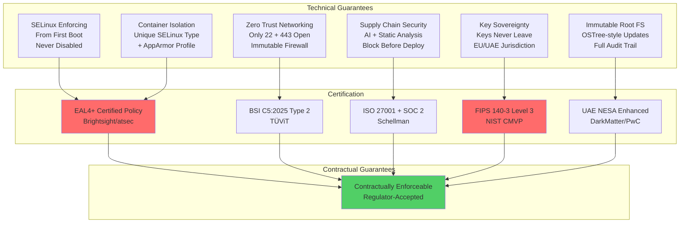

---

## 10. Revenue Projection Timeline

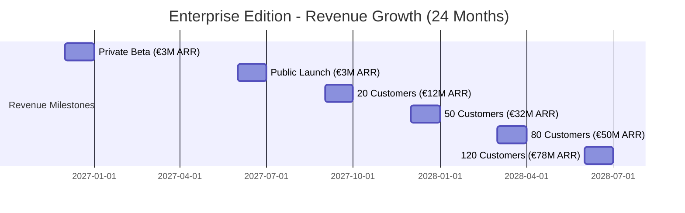

---

## 11. OPEX Breakdown (Year 3 Steady-State)

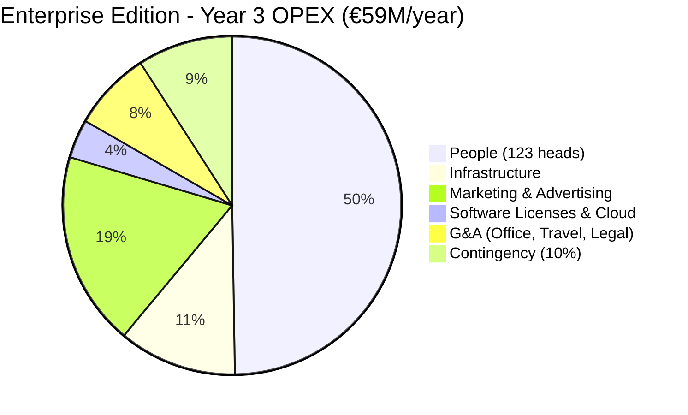

---

## 12. Team Structure & Headcount Growth

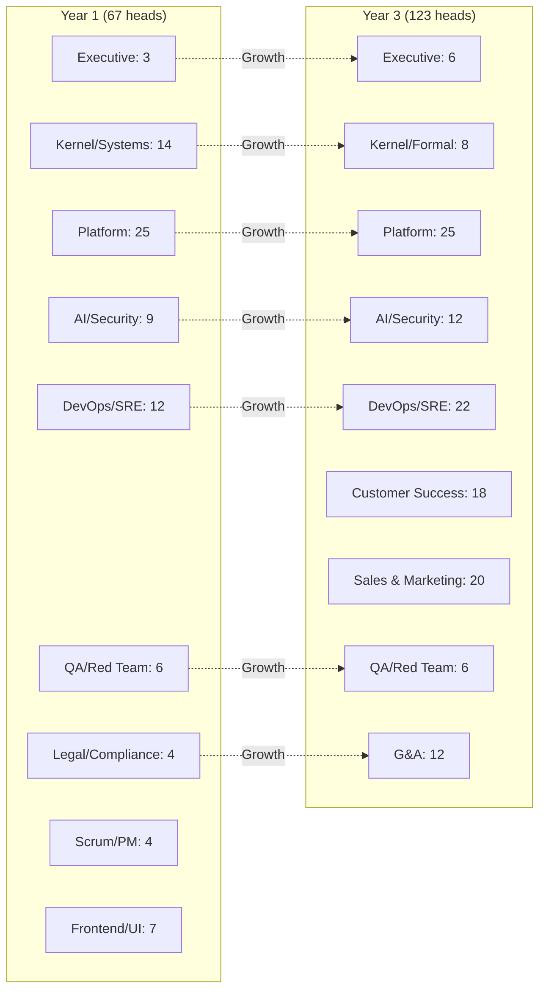

---

## 13. Infrastructure Network Topology

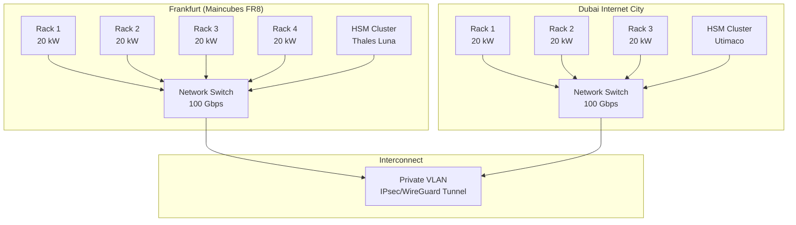

---

## 14. Compliance Certification Timeline

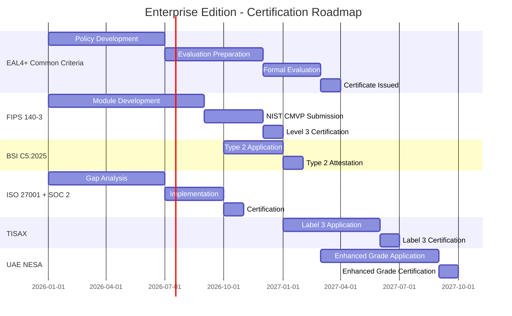

---

## 15. Risk & Mitigation Flow

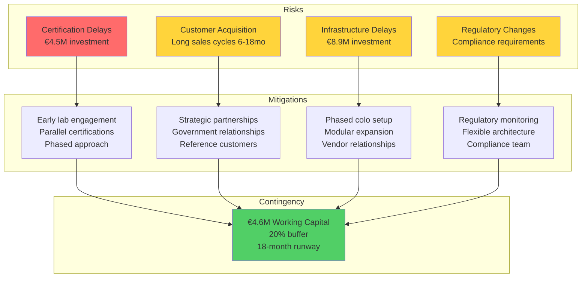

---

## 16. Customer Segmentation & Pricing

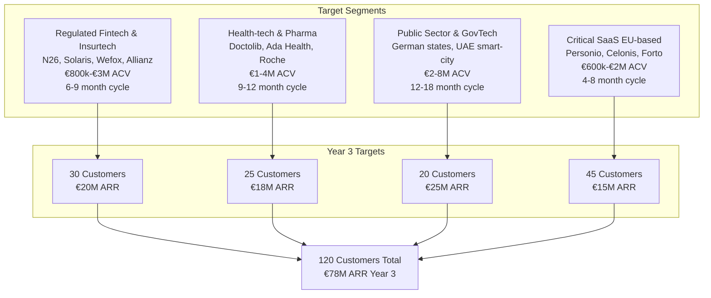

---

## 17. Performance Benchmarks

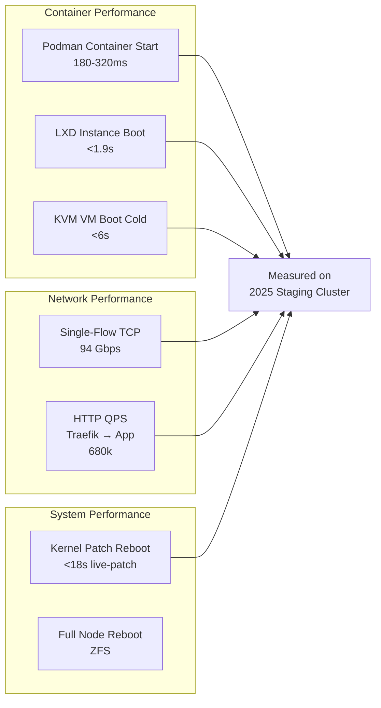

---

**Last Updated**: January 2026  
**Document Version**: 1.0

