# FORTRESS EDITION - Architecture & Process Diagrams

**Investment**: €200 Million | **Timeline**: 36 months to profitability | **Target**: EAL7+ Formally Verified PaaS

---

## 1. System Architecture Overview

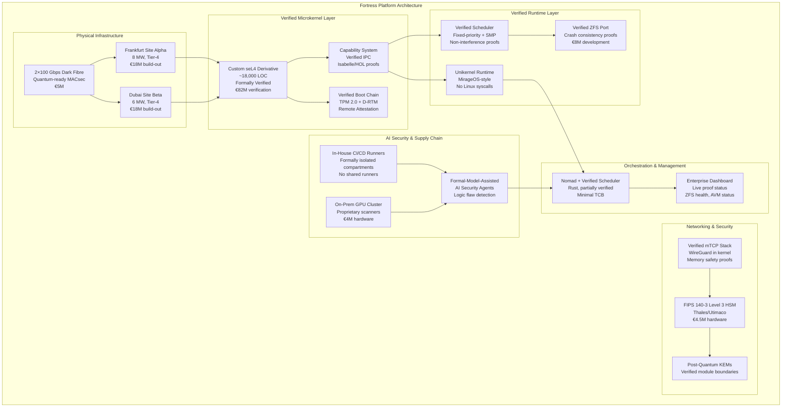

---

## 2. Formal Verification Process Flow

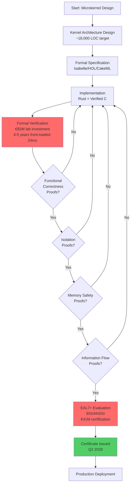

---

## 3. Deployment & Boot Process

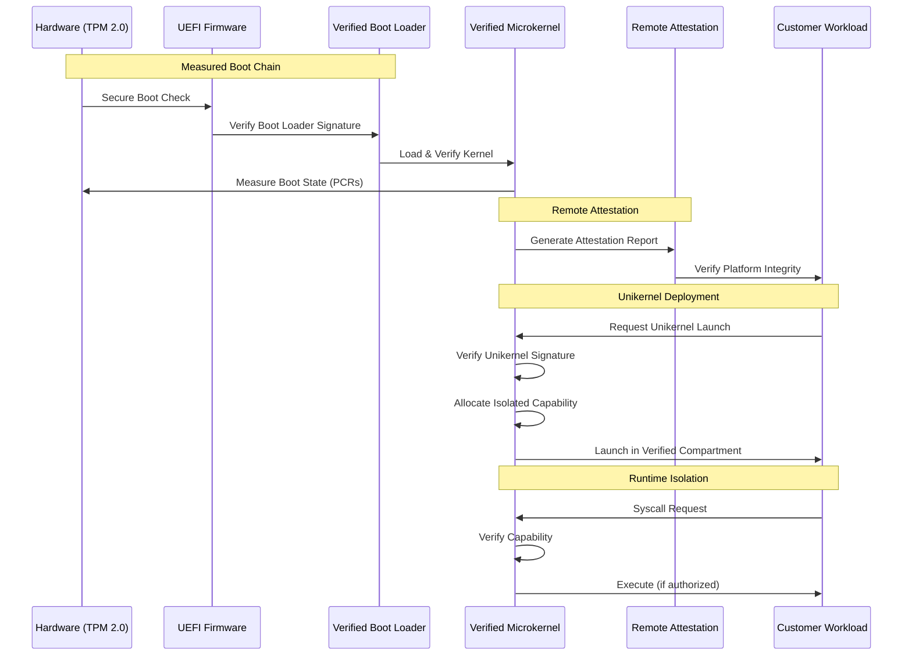

---

## 4. Supply Chain Security Flow

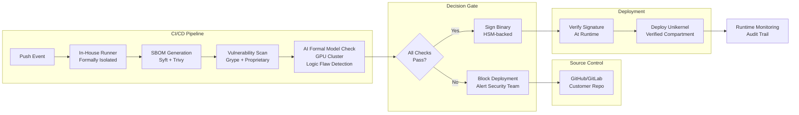

---

## 5. Cost Breakdown (18-Month CAPEX)

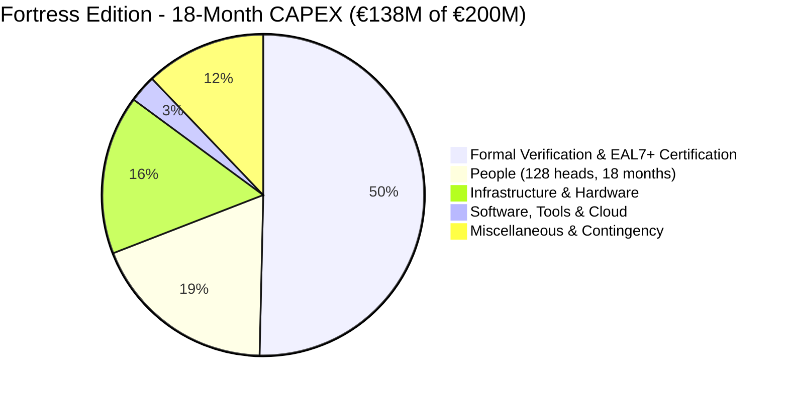

---

## 6. Detailed Cost Flow

```mermaid
graph TD
    TOTAL[Total Raise: €200M]
    
    subgraph "Certification & Verification (€124.2M)"
        VLAB[Formal Verification Lab<br/>€82M<br/>Wyomatix/TrustInSoft-class<br/>4-5 years, front-loaded 24mo]
        EAL7[EAL7+ Evaluation<br/>€41M<br/>BSI/ANSSI oversight<br/>Historical: €100M+ precedent]
        COMP[Compliance Audits<br/>€1.2M<br/>SOC 2, ISO 27001, TISAX, NESA]
    end
    
    subgraph "People (€46.2M over 18mo)"
        EXEC[Executive Team<br/>3 heads: CTO, CISO, VP Eng<br/>€1.8M/year]
        LEADS[Tech Leads<br/>15 heads<br/>€2.7M/year]
        KERNEL[Kernel/Formal Methods<br/>28 heads<br/>€5.04M/year]
        AI_TEAM[AI/ML Specialists<br/>18 heads<br/>€3.24M/year]
        PLATFORM[Platform Engineering<br/>40 heads<br/>€9.6M/year]
        DEVOPS[DevOps/SRE<br/>20 heads<br/>€4M/year]
        QA[QA/Red Team<br/>16 heads<br/>€3.2M/year]
        LEGAL[Legal/Compliance<br/>8 heads<br/>€1.6M/year]
    end
    
    subgraph "Infrastructure (€39.5M)"
        CAGES[Tier-4 Cages<br/>Frankfurt + Dubai<br/>€18M build-out]
        SERVERS[High-Assurance Servers<br/>HPE Superdome Flex / Dell<br/>TPM 2.0 + HSM<br/>€12M]
        HSM_HW[HSMs & Signing Infrastructure<br/>€4.5M]
        NETWORK[Network Infrastructure<br/>100 Gbps DDoS-protected<br/>Dedicated lambda DE↔UAE<br/>€5M]
    end
    
    subgraph "Software & Tools (€6.8M)"
        LICENSES[Enterprise Licenses<br/>GitHub, SonarQube, Coverity<br/>€2.8M]
        GPU_CLOUD[GPU Clusters<br/>On-prem + cloud credits<br/>€4M]
    end
    
    subgraph "Miscellaneous (€29.9M)"
        OFFICE[Office Space<br/>Berlin/Munich + Dubai<br/>€2.5M]
        TRAVEL[Travel, Legal, Insurance<br/>€3M]
        CONTINGENCY[20% Contingency<br/>€24.4M]
    end
    
    TOTAL --> VLAB
    TOTAL --> EAL7
    TOTAL --> COMP
    TOTAL --> EXEC
    TOTAL --> CAGES
    TOTAL --> LICENSES
    TOTAL --> CONTINGENCY
```

---

## 7. Timeline & Milestones (36 Months)

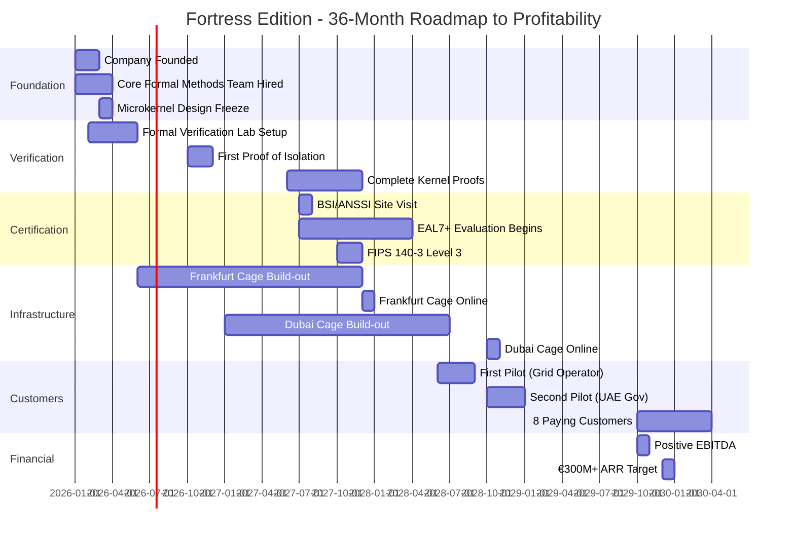

---

## 8. Customer Onboarding Flow

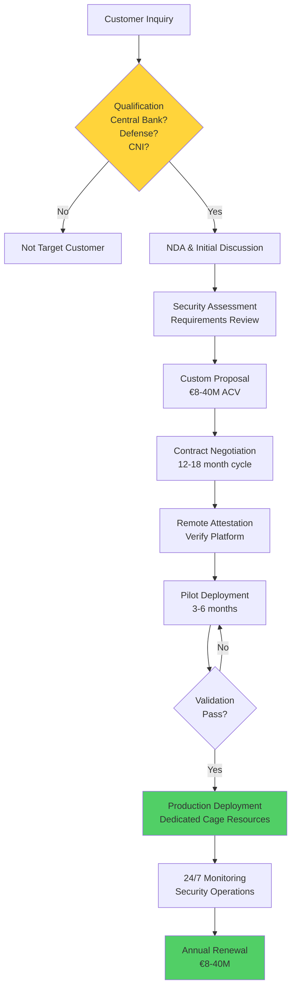

---

## 9. Security Guarantee Flow

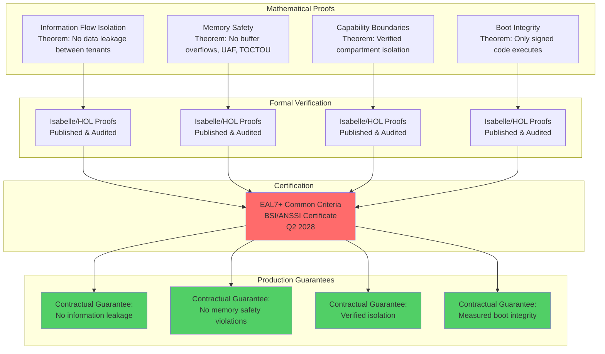

---

## 10. Revenue Projection Timeline

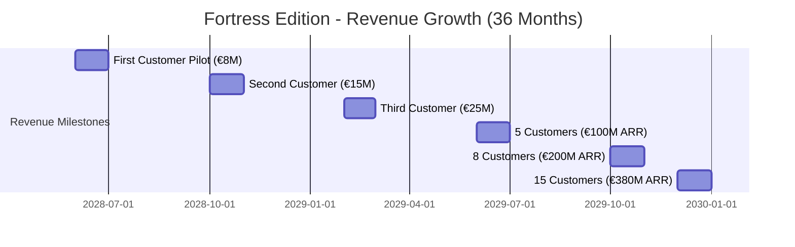

---

## 11. OPEX Breakdown (Year 3 Steady-State)

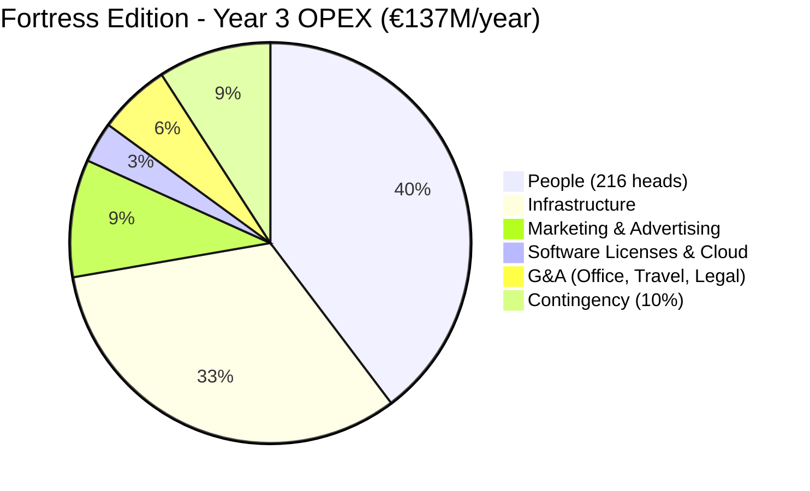

---

## 12. Team Structure & Headcount Growth

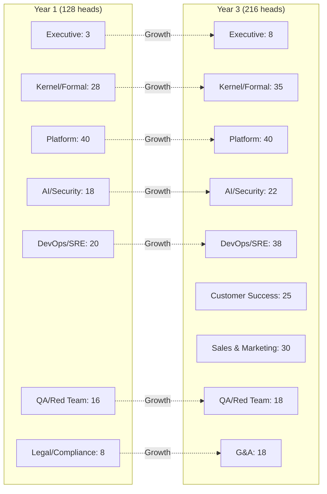

---

## 13. Infrastructure Network Topology

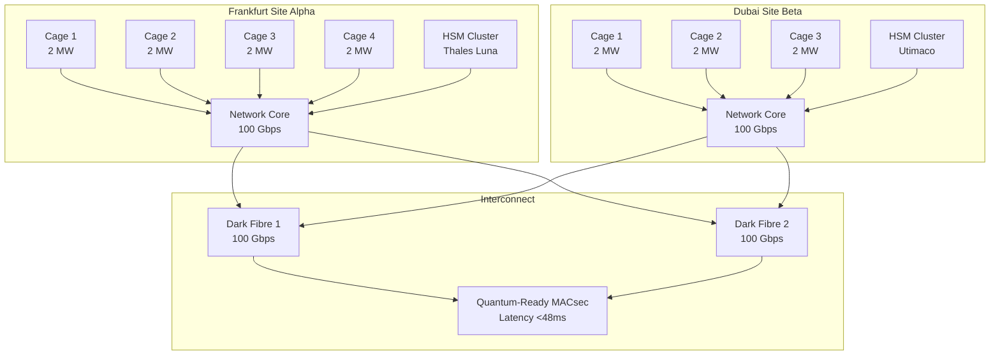

---

## 14. Risk & Mitigation Flow

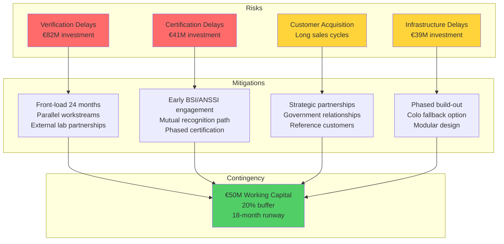

---

## 15. Certification Timeline

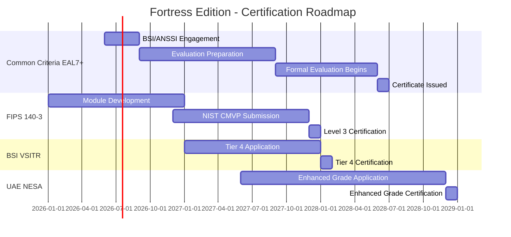

---

**Last Updated**: January 2026  
**Document Version**: 1.0

